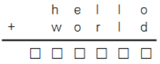

보물
---

date : 2022-03-10\
url : https://www.acmicpc.net/problem/13140

문제
---

N이 주어질 때 hello + world = N을 만족하는 서로 다른 한 자리 자연수(0 포함) d, e, h, l, o, r, w를 구해서 아래 그림과 같은 형태로 출력하는 프로그램을 작성하여라.\
단, h와 w는 0이 될 수 없다.



입력
---
첫 번째 줄에 양의 정수 N이 주어진다. N은 32비트 정수 범위로 표현할 수 있는 수만 들어온다.

출력
---
만약 답이 없으면 'No Answer'을 출력한다. 그렇지 않은 경우 가능한 답들 중에서 아무거나 출력한다.

예제
--

### 1)
- input
```
66971
```

- output
```
  12334
+ 54637
-------
  66971
```

### 2)
- input
```
199991
```

- output
```
No Answer
```

풀이
---

```
모든 경우의 수를 구하거나 순차적으로 구해가면서 알파벳에 맞게 값을 넣고 결과를 확인해본다 
```