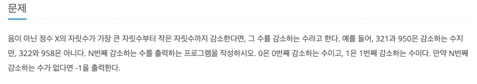

감소하는 수
---

date : 2022-05-26   
url : https://www.acmicpc.net/problem/1038   
difficulty : Gold 5   
status : success

문제
---


입력
---


출력
---


예제
--

### 1)
- input
```
18
```

- output
```
42
```

### 2)

- input
```
0
```

- output
```
0
```

### 2)

- input
```
500000
```

- output
```
-1
```

### 3)

- input
```
1022
```

- output
```
9876543210
```

풀이
---
가장 마지막 숫자보다 더 작은 숫자들을 붙인 것이다.    
0부터 9번째 까지 감소하는 숫자는 0 1 2 3 4 5 6 7 8 9 이다.   
이후 두자리 숫자에서 1 로 시작할 경우 1 보다 작은 0이 붙어 10 이 된다.   
이후 2 에서 더 작은 숫자들을 추가적으로 붙여보니, 20, 21 이 된다.
이런식으로 N번째 숫자까지 반복을 하면 된다.   
출처 : [얍문's Coding World..:티스토리](https://yabmoons.tistory.com/553)

