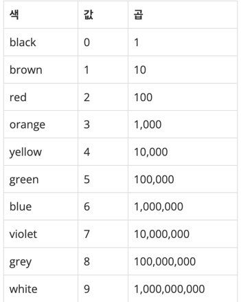

저항
---

date : 2022-04-11   
url : https://www.acmicpc.net/problem/1076   
difficulty : Bronze 2    
status : success

문제
---
전자 제품에는 저항이 들어간다. 저항은 색 3개를 이용해서 그 저항이 몇 옴인지 나타낸다. 처음 색 2개는 저항의 값이고, 마지막 색은 곱해야 하는 값이다. 저항의 값은 다음 표를 이용해서 구한다.

예를 들어, 저항의 색이 yellow, violet, red였다면 저항의 값은 4,700이 된다.

입력
---
첫째 줄에 첫 번째 색, 둘째 줄에 두 번째 색, 셋째 줄에 세 번째 색이 주어진다. 위의 표에 있는 색만 입력으로 주어진다.

출력
---
입력으로 주어진 저항의 저항값을 계산하여 첫째 줄에 출력한다.

예제
--

### 1)
- input
```
yellow
violet
red
```

- output
```
4700
```

### 2)

- input
```
orange
red
blue
```

- output
```
32000000
```

### 3)

- input
```
white
white
white
```

- output
```
99000000000
```

풀이
---

