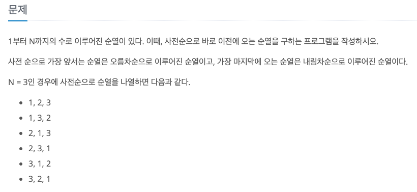
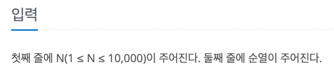
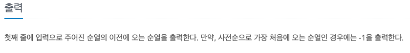

이전 순열
---

date : 2022-06-03   
url : https://www.acmicpc.net/problem/10973   
difficulty : Silver 3   
status : success

문제
---


입력
---


출력
---


예제
--

### 1)
- input
```
4
1 2 3 4
```

- output
```
-1
```

### 2)

- input
```
5
5 4 3 2 1
```

- output
```
5 4 3 1 2
```

### 3)

- input
```
```

- output
```
```

풀이
---
https://dundung.tistory.com/58
