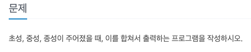
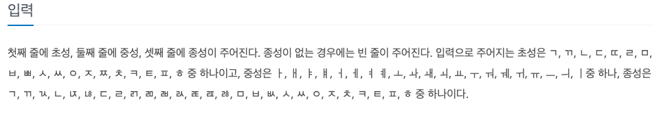
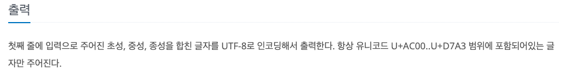

초성 중성 종성 2
---

date : 2022-06-10   
url : https://www.acmicpc.net/problem/11285   
difficulty : Bronze 1    
status : success

문제
---


입력
---


출력
---


예제
--

### 1)
- input
```
ㄱ
ㅏ

```

- output
```
가
```

### 2)

- input
```
ㄷ
ㅏ
ㄺ
```

- output
```
닭
```

### 3)

- input
```
ㅂ
ㅐ
ㄱ
```

- output
```
백
```

### 3)

- input
```
ㅈ
ㅜ
ㄴ
```

- output
```
준
```

풀이
---

