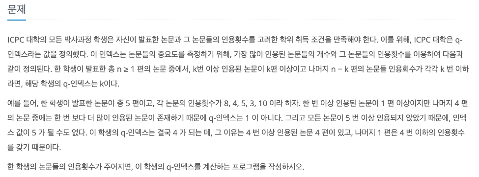
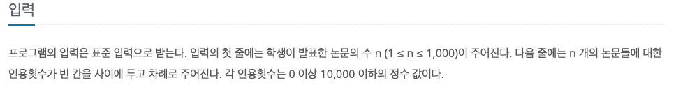
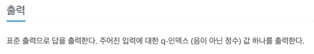

Q-인덱스
---

date : 2022-06-03   
url : https://www.acmicpc.net/problem/13333   
difficulty : Bronze 1   
status : complete

문제
---


입력
---


출력
---


예제
--

### 1)
- input
```
5
8 4 5 3 10
```

- output
```
4
```

### 2)

- input
```
4
0 0 0 0
```

- output
```
0
```

### 3)

- input
```
6
12 7 6 8 9 10
```

- output
```
6
```

풀이
---

