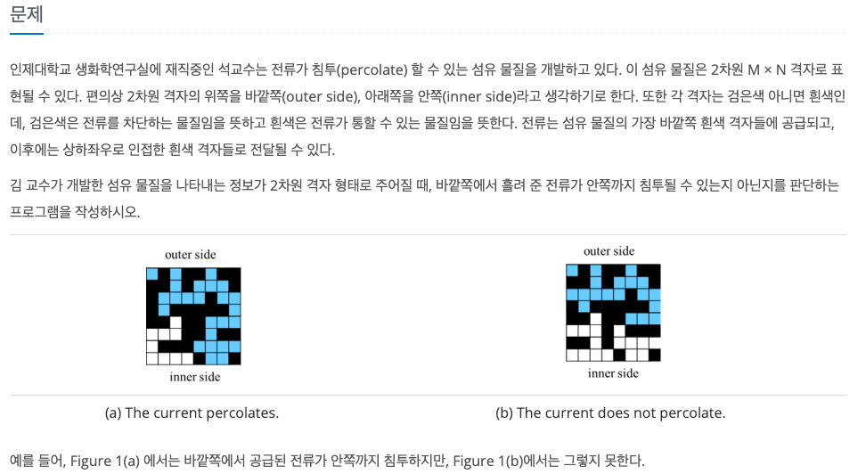
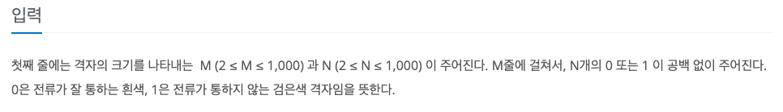

침투
---

date : 2022-05-20   
url : https://www.acmicpc.net/problem/13565   
difficulty : Silver 2   
status : success

문제
---


입력
---


출력
---


예제
--

### 1)
- input
```
5 6
010101
010000
011101
100011
001011
```

- output
```
NO
```

### 2)

- input
```
8 8
11000111
01100000
00011001
11001000
10001001
10111100
01010000
00001011
```

- output
```
YES
```

### 3)

- input
```
2 2
01
10
```

- output
```
NO
```

### 4)

- input
```
2 2
01
00
```

- output
```
YES
```

### 5)

- input
```
2 4
0111
1001
```

- output
```
NO
```

### 6)

- input
```
2 4
0111
0101
```

- output
```
YES
``

풀이
---