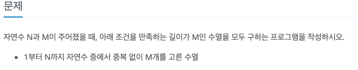
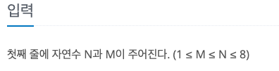
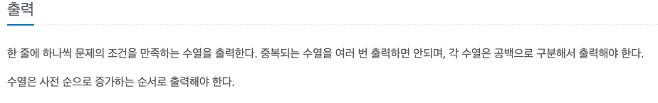

N과 M (1)
---

date : 2022-05-31   
url : https://www.acmicpc.net/problem/15649   
difficulty : Silver 3    
status : success

문제
---


입력
---


출력
---


예제
--

### 1)
- input
```
3 1
```

- output
```
1
2
3
```

### 2)

- input
```
4 2
```

- output
```
1 2
1 3
1 4
2 1
2 3
2 4
3 1
3 2
3 4
4 1
4 2
4 3
```
### 3)

- input
```
4 4
```

- output
```
1 2 3 4
1 2 4 3
1 3 2 4
1 3 4 2
1 4 2 3
1 4 3 2
2 1 3 4
2 1 4 3
2 3 1 4
2 3 4 1
2 4 1 3
2 4 3 1
3 1 2 4
3 1 4 2
3 2 1 4
3 2 4 1
3 4 1 2
3 4 2 1
4 1 2 3
4 1 3 2
4 2 1 3
4 2 3 1
4 3 1 2
4 3 2 1
```

풀이
---

