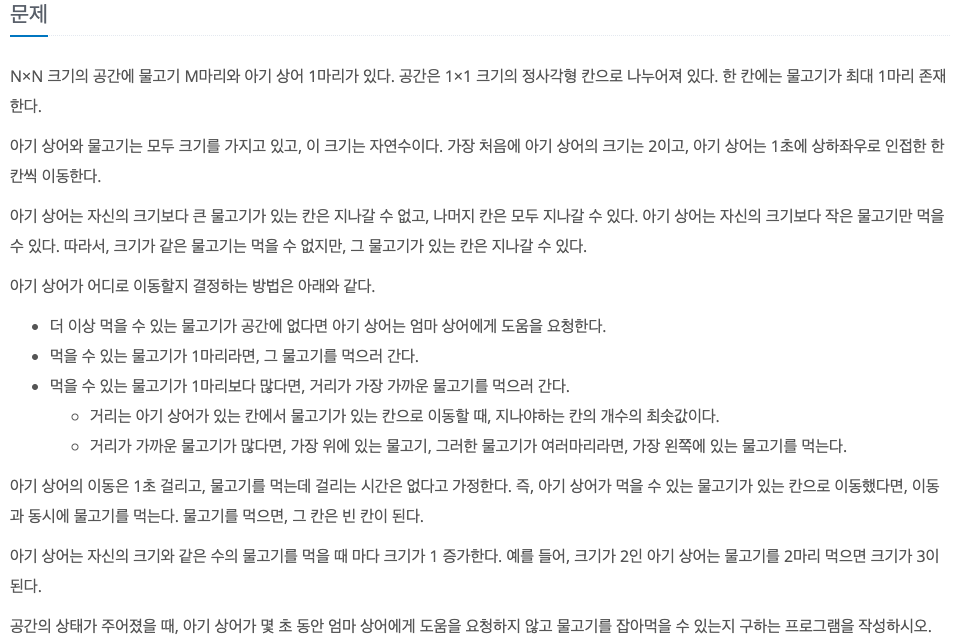
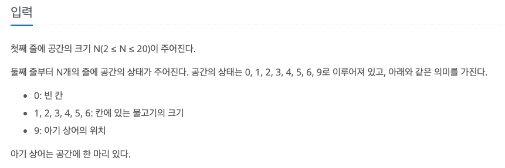
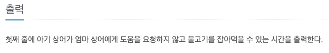

아기 상어
---

date : 2022-05-11   
url : https://www.acmicpc.net/problem/16236   
difficulty : Gold 3   
status : ready

문제
---


입력
---


출력
---


예제
--

### 1)
- input
```
3
0 0 0
0 0 0
0 9 0
```

- output
```
0
```

### 2)

- input
```
3
0 0 1
0 0 0
0 9 0
```

- output
```
3
```

### 3)

- input
```
4
4 3 2 1
0 0 0 0
0 0 9 0
1 2 3 4
```

- output
```
14
```

### 4)

- input
```
6
5 4 3 2 3 4
4 3 2 3 4 5
3 2 9 5 6 6
2 1 2 3 4 5
3 2 1 6 5 4
6 6 6 6 6 6
```

- output
```
60
```

### 5)

- input
```
6
6 0 6 0 6 1
0 0 0 0 0 2
2 3 4 5 6 6
0 0 0 0 0 2
0 2 0 0 0 0
3 9 3 0 0 1
```

- output
```
48
```

### 6)

- input
```
6
1 1 1 1 1 1
2 2 6 2 2 3
2 2 5 2 2 3
2 2 2 4 6 3
0 0 0 0 0 6
0 0 0 0 0 9
```

- output
```
39
```

풀이
---

