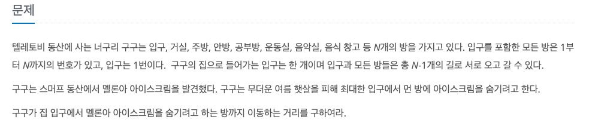
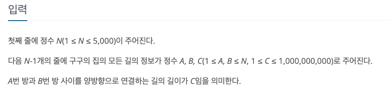

너구리 구구
---

date : 2022-06-13   
url : https://www.acmicpc.net/problem/18126   
difficulty : Silver 2    
status : success

문제
---


입력
---


출력
---


예제
--

### 1)

- input

```
4
1 2 3
2 3 2
2 4 4
```

- output

```
7
```

### 2)

- input

```
```

- output

```
```

### 3)

- input

```
```

- output

```
```

풀이
---
dfs 를 이용