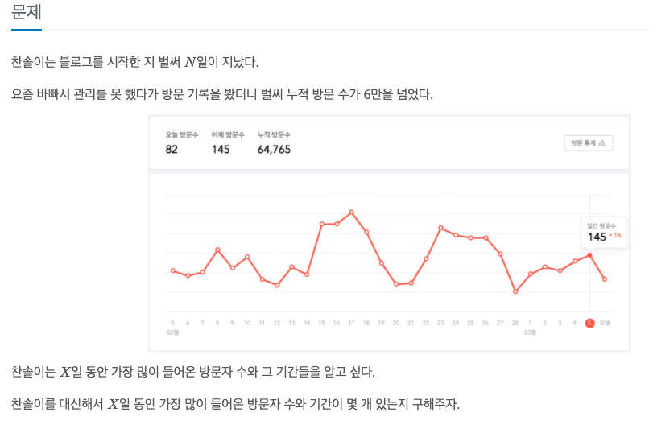
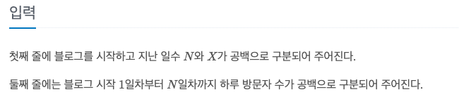
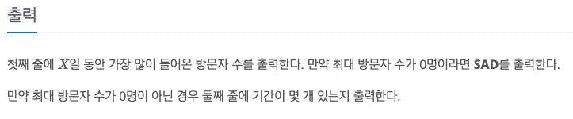

블로그
---

date : 2022-05-17   
url : https://www.acmicpc.net/problem/21921   
difficulty : Silver 3   
status : success

문제
---


입력
---


출력
---


예제
--

### 1)
- input
```
5 2
1 4 2 5 1
```

- output
```
7
1
```

### 2)

- input
```
7 5
1 1 1 1 1 5 1
```

- output
```
9
2
```

### 3)

- input
```
5 3
0 0 0 0 0
```

- output
```
SAD
```

풀이
---

