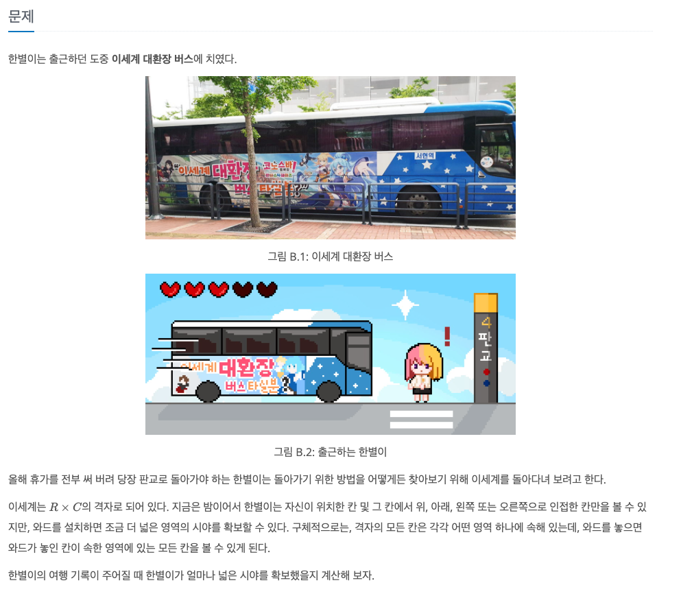
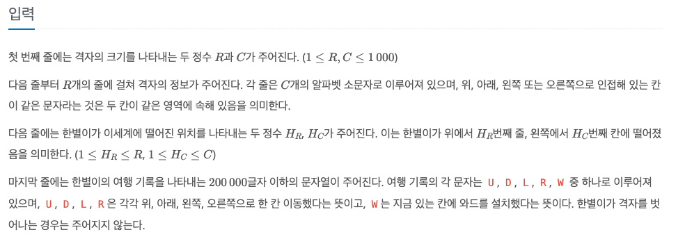

와드
---

date : 2022-06-14   
url : https://www.acmicpc.net/problem/23747   
difficulty : Gold 4   
status : success

문제
---


입력
---


출력
---


예제
--

### 1)
- input
```
4 5
aaabc
dcbbc
dccaa
ddaaa
3 4
WLLLWUURRD
```

- output
```
##.##
....#
.#...
.....
```

### 2)

- input
```
3 3
abc
def
ghi
2 2
LU
```

- output
```
..#
.##
###
```

### 3)

- input
```
```

- output
```
```

와드를 설치하지는 않았지만, 한별이의 최종 위치의 위, 아래, 왼쪽, 오른쪽 칸은 시야로 확보하고 있다.   
지나온 경로를 모두 시야로 확보하지는 않는다.

풀이
---

