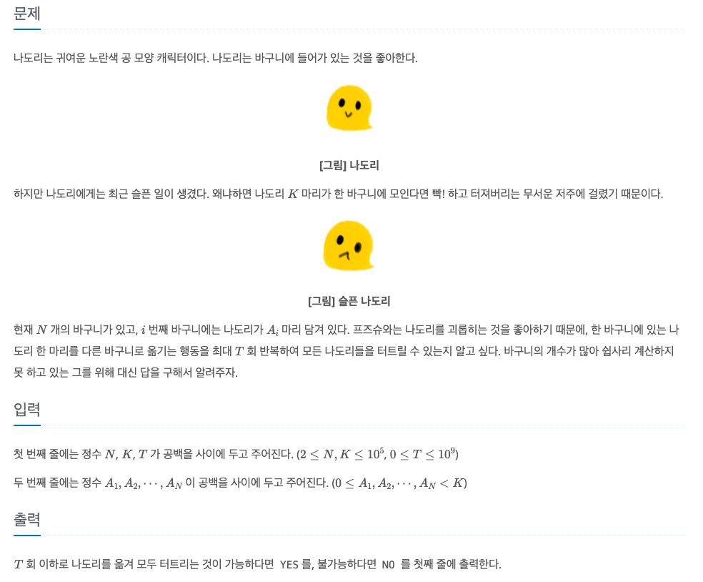
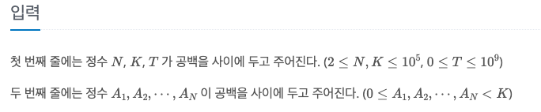

나도리팡
---

date : 2022-05-0 9  
url : https://www.acmicpc.net/problem/24508   
difficulty : Silver 1    
status : success

문제
---


입력
---


출력
---


예제
--

### 1)
- input
```
2 2 1
1 1
```

- output
```
Yes
```
1번 바구니의 나도리 한 마리를 2번 바구니로 옮긴다면, 2마리가 되어 터지면서 모든 나도리를 없앨 수 있다.

### 2)

- input
```
3 5 2
1 2 2
```

- output
```
NO
```

### 3)

- input
```
3 5 3
1 2 2
```

- output
```
YES
```

### 4)

- input
```
3 3 100000
2 1 2
```

- output
```
NO
```
풀이
---

