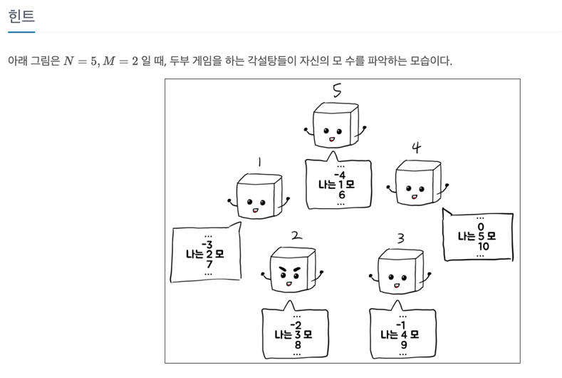

두~~부 두부 두부
---

date : 2022-05-27   
url : https://www.acmicpc.net/problem/25175   
difficulty : Bronze 3   
status : success

문제
---


입력
---


출력
---


예제
--

### 1)
- input
```
7 2 4
```

- output
```
3
```

### 2)

- input
```
6 1 -1
```

- output
```
3
```

풀이
---

