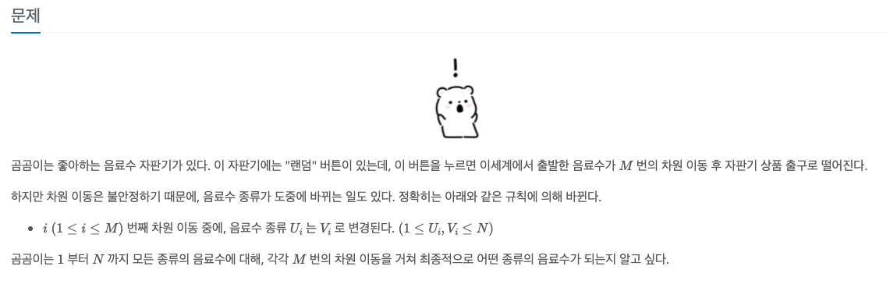
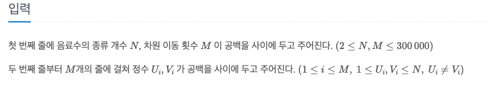
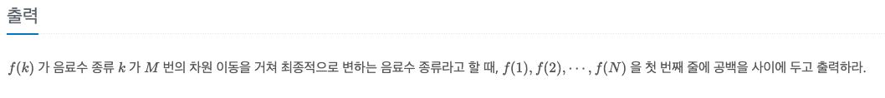
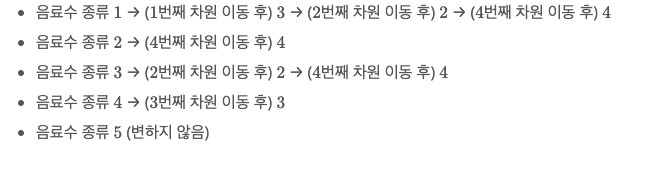

곰곰이와 자판기
---

date : 2022-06-09   
url : https://www.acmicpc.net/problem/25200   
difficulty : Gold 1    
status : ready

문제
---


입력
---


출력
---


예제
--


### 1)
- input
```
5 4
1 3
3 2
4 3
2 4
```

- output
```
4 4 4 3 5
```

### 2)

- input
```
```

- output
```
```

### 3)

- input
```
```

- output
```
```

풀이
---

