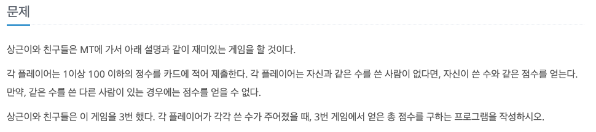
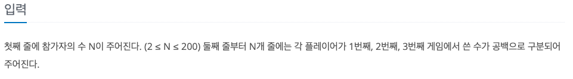
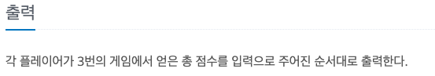

유니크
---

date : 2022-05-13   
url : https://www.acmicpc.net/problem/5533   
difficulty : Bronze 1   
status : ready

문제
---


입력
---


출력
---


예제
--

### 1)
- input
```
5
100 99 98
100 97 92
63 89 63
99 99 99
89 97 98
```

- output
```
0
92
215
198
89
```

### 2)

- input
```
3
89 92 77
89 92 63
89 63 77
```

- output
```
0
63
63
```

풀이
---

